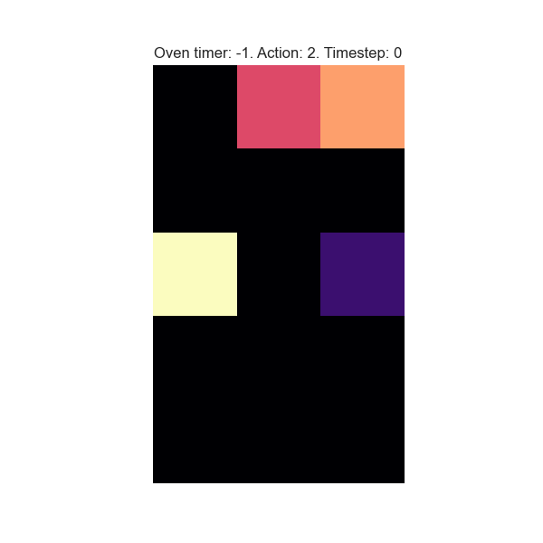
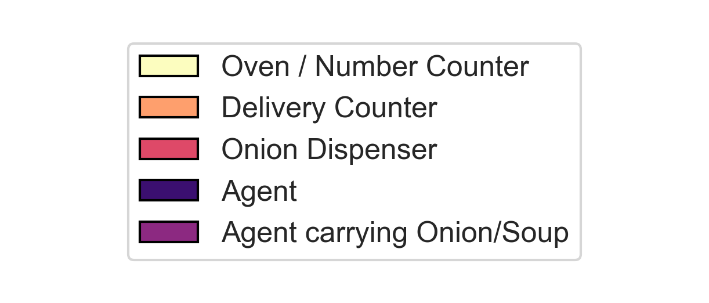
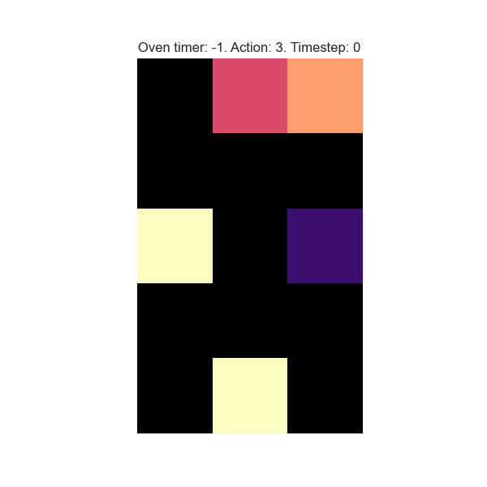

# Temporal Interference in a Deep Reinforcement Learning (DRL) Agent 
This repository contains code to reproduce the results and analysis presented in the paper, "Modulation of temporal decision-making in a deep reinforcement learning agent under the dual-task paradigm".

You can read the full paper here: https://arxiv.org/pdf/2511.01415

## Paper Overview

This paper explores the temporal interference in a dual-task paradigm using a deep reinforcement learning (drl) setup. Experiments were conducted using a modified OverCooked game environment to study time-keeping in a drl agent performing an embedded time production task in a single task (T) and dual task (T+N) setup. We found that the dual-task agent exhibited significant overproduction in comparison to its single task counterpart. This finding is also consistent with human timing research. Further investigation is needed to understand the underlying time-keeping mechanisms in drl agents that lead to this behaviour. This study is only a small step towards exploring parallels between emergent DRL behavior and behavior observed in biological systems in order to facilitate a better understanding of both.

**Single Task (T) agent trajectory** 
 

  
*Target duration = 9*

**Dual Task (T+N) agent trajectory** 

## Key Features
- Uses a modified OverCooked environment to study temporal interference in a single and dual task setups using an embedded timing task.
- Analysis of temporal interference behaviour and neural dynamics in drl agents 
- Multiple environment variant - single and dual task , delayed reward, incremental learning
- Provides a framework for further experimentation and analysis of timing behaviour in DRL agents.

## 📂 Repository Structure
### rl_environments/
- `singleagent_oneoven.py` — A simplified single-agent version of OverCooked in a 5x3 grid world for the single task (T) variant
- `singleagent_dualtask.py` — The dual task (T+N) variant

- `singleagent_dualtask_delayedreward.py` —  The dual task (T+N) variant but with a delayed reward instead of an immediate reward for correctly interacting with the number game counter
- `singleagent_oneoven_incrementallearning.py` — The single task (T) variant with a few changes to first train the agent on single task (timing task) and then train it on dual task (T+N).
- 
### Training scripts
- `singleagent_cnnlstmmlp.py` — Main training script for single task (T) agent 
- `singleagent_dualtask_cnnlstmmlp.py` — Training script for the dual task (T+N) variant.
- `singleagent_incrementallearning_cnnlstmmlp.py` — Training script for the incremental learning variant

### Other
- `utils/`  — Contains function to calculate "first oven check"
- `model-wrappers` — Model wrappers to calculate layer-level outputs
- `feature_extractors` — A custom CNN feature extractor to handle small grid size of 5x3
- `drl_tempoal_interference_analysis.ipynb` - Notebook containing analysis for the paper.

## Python Environment
The code was tested on Python 3.12

